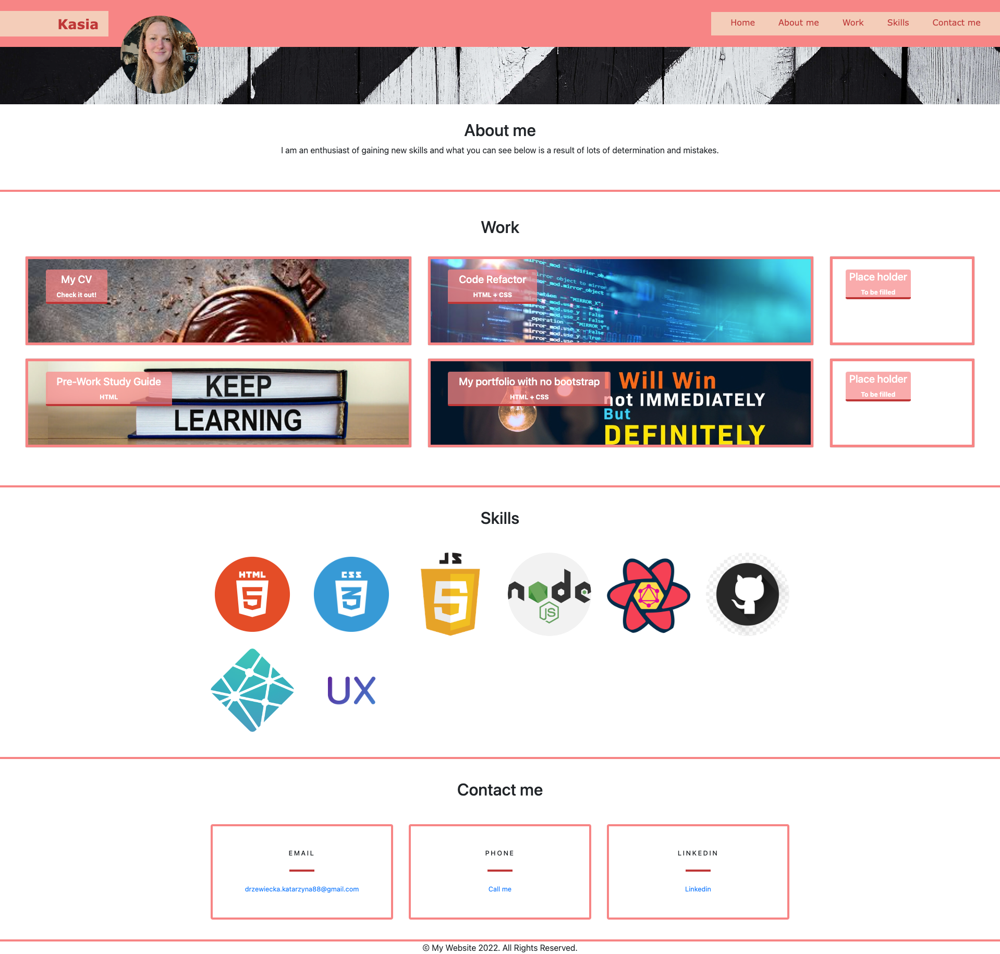

# Bootstrap-Portfolio

## Description

This portfolio was made based on the original portfolio:[My portfolio](https://drzazga88.github.io/My_portfolio/). The goal was to recreate the portfolio using Bootstrap. This portfolio was slightly modified and skills section added.

## Table of content

1. Header
2. About me
3. Work:

- My CV
- Code refactor
- Place holder
- Pre-Work Study Guide
- My portfolio with no bootstrap
- Place holder

4. Skills:

- HTML
- CSS
- JavaScript
- Node.JS
- React
- GitHub
- Netflify
- UX design

5. Contact me
6. Footer

### Screenshot of the ready page

